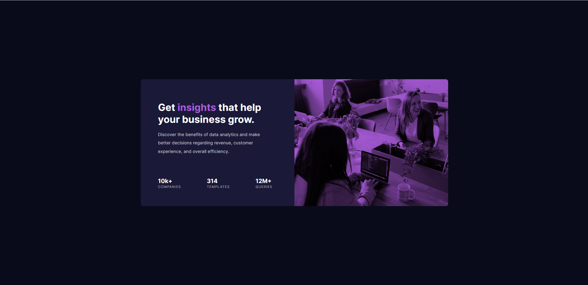

# Frontend Mentor - Stats preview card component solution

This is a solution to the [Stats preview card component challenge on Frontend Mentor](https://www.frontendmentor.io/challenges/stats-preview-card-component-8JqbgoU62).


## Table of contents

  - [Overview](#overview)
  - [The challenge](#the-challenge)
  - [Screenshot](#screenshot)
  - [Links](#links)
  - [My process](#my-process)
  - [Built with](#built-with)
  - [What I learned](#what-i-learned)
  - [Continued development](#continued-development)
  - [Author](#author)

## Overview

The challenge is to build out this card component and get it looking as close to the design as possible.

### The challenge

Users should be able to:

- View the optimal layout depending on their device's screen size

### Screenshot

Here's the desktop format


Here the tablet format


And finally the mobile format

### Links

- Solution URL: [The github repository](https://github.com/Everezze/stats_preview_card_component)
- Live Site URL: [The github live page](https://everezze.github.io/stats_preview_card_component/)

## My process

Setting up the HTML structure on paper then putting styles with CSS.

### Built with

- Semantic HTML5 markup
- CSS
- Flexbox
- Mobile-first workflow

### What I learned

I learned that the <picture> tag is only a wrapper to an image and so when I tried to put a blend mode on a <picture> tag with an image and a fallback image (for responsiveness) the blend mode didn't apply in mobile format but worked in desktop format.

```css
.proud-of-this-css {
  mix-blend-mode: multiply;
  /* background-blend-mode: multiply; */
}
```
### Continued development

I have to think more about my html structure as sometimes the structure isn't suited for responsiveness or it will be too much over-work due to poorly chosen html structure.
I also have to play with images to actually understand their behaviour and quirks.

## Author

- Website - [My Github Profile](https://github.com/Everezze)
- Frontend Mentor - [@Everezze](https://www.frontendmentor.io/profile/Everezze)